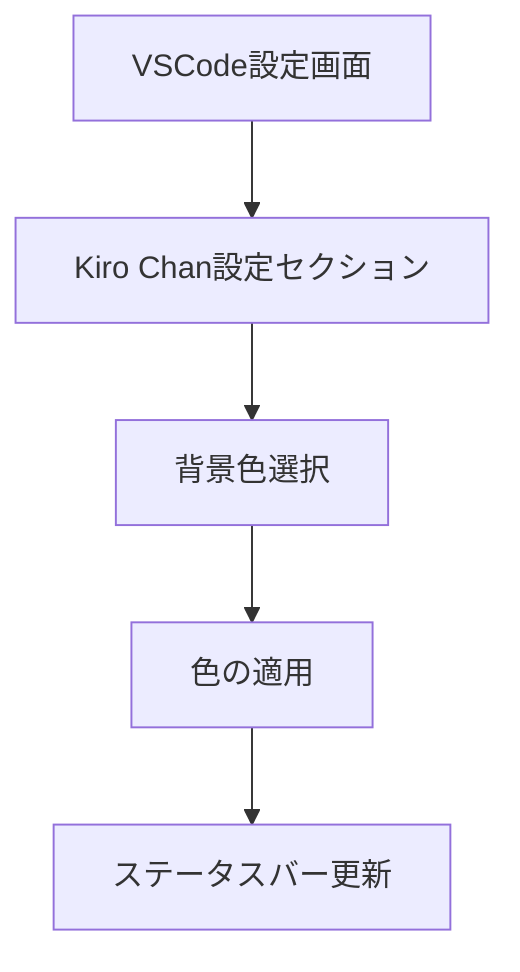

# Kiro-chan背景色変更機能 - 要件定義書

## 1. Product Overview
Kiro-chanエクステンションに背景色をカスタマイズできる機能を追加し、ユーザーが好みの色でステータスバーキャラクターの背景を設定できるようにします。
- VSCode設定メニューから直感的に背景色を変更可能にし、ユーザーエクスペリエンスを向上させます。
- デフォルトの青色設定により、統一感のある見た目を提供しつつ、個人の好みに合わせたカスタマイズを可能にします。

## 2. Core Features

### 2.1 User Roles
役割の区別は不要です。すべてのユーザーが同じ機能にアクセスできます。

### 2.2 Feature Module
背景色変更機能は以下の主要コンポーネントで構成されます：
1. **設定メニュー**: VSCode設定画面での背景色選択オプション
2. **色選択インターフェース**: カラーピッカーまたは事前定義色の選択
3. **リアルタイム適用**: 設定変更時の即座の背景色反映

### 2.3 Page Details

| Page Name | Module Name | Feature description |
|-----------|-------------|---------------------|
| VSCode設定画面 | 背景色設定項目 | カラーピッカーまたはプリセット色から背景色を選択。デフォルト値は青色（#007ACC）に設定 |
| ステータスバー | 背景色適用 | 選択された背景色をKiroキャラクターの背景に適用。リアルタイムで色変更を反映 |
| 設定管理 | 設定保存・読み込み | 背景色設定をVSCode設定として永続化。エクステンション再起動時も設定を維持 |

## 3. Core Process
ユーザーは以下の流れで背景色を変更できます：
1. VSCodeの設定画面（Preferences > Settings）を開く
2. 「Kiro Chan」セクションで背景色設定項目を見つける
3. カラーピッカーまたはプリセット色から好みの色を選択
4. 設定が自動保存され、ステータスバーのKiroキャラクターの背景色が即座に変更される
5. エクステンション再起動後も設定が保持される

## 4. User Interface Design
### 4.1 Design Style
- **主要色**: デフォルト背景色として青色（#007ACC）を使用
- **設定UI**: VSCodeの標準設定UIスタイルに準拠
- **カラーピッカー**: VSCode標準のカラーピッカーコンポーネントを使用
- **フォント**: VSCodeのデフォルトフォント設定に従う
- **レイアウト**: 既存のKiro Chan設定項目と統一感のある配置

### 4.2 Page Design Overview

| Page Name | Module Name | UI Elements |
|-----------|-------------|-------------|
| VSCode設定画面 | 背景色設定 | カラーピッカー入力フィールド、プレビュー表示、リセットボタン（オプション） |
| ステータスバー | Kiroキャラクター | 背景色が適用されたキャラクターアイコン、ホバー時のツールチップ |

### 4.3 Responsiveness
デスクトップ環境のVSCode専用のため、レスポンシブ対応は不要です。VSCodeのテーマ変更に対応し、ライト・ダークテーマ両方で適切に表示されるよう配慮します。