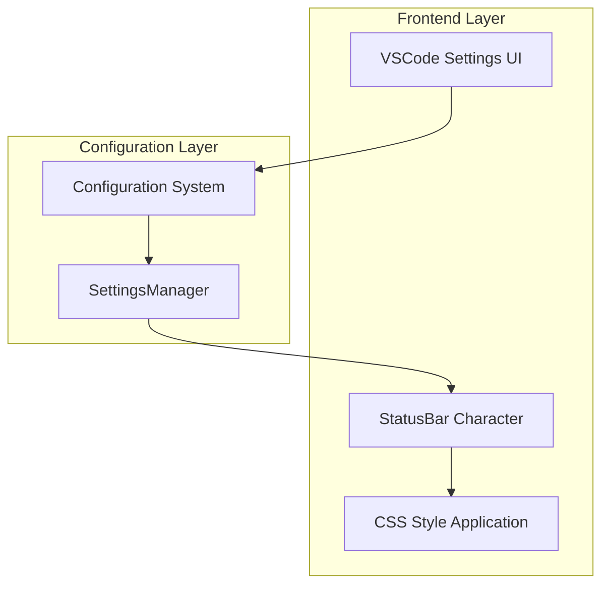
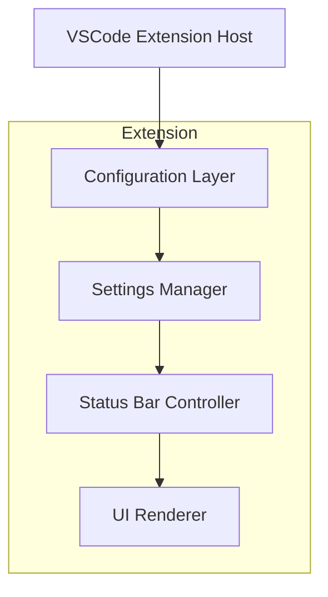
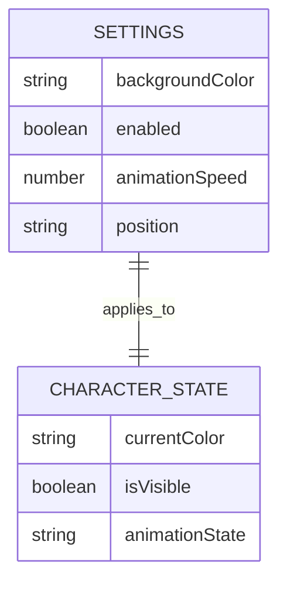

# Kiro-chan背景色変更機能 - 技術仕様書

## 1. Architecture design



## 2. Technology Description

* Frontend: TypeScript + VSCode Extension API

* Configuration: VSCode Settings API

* Styling: CSS-in-JS / Inline Styles

* Storage: VSCode Configuration Storage

## 3. Route definitions

設定変更の流れ：

| Route                | Purpose          |
| -------------------- | ---------------- |
| VSCode Settings      | 背景色設定の変更インターフェース |
| Configuration Update | 設定値の検証と保存        |
| Settings Manager     | 設定値の管理と適用        |
| Status Bar Update    | ステータスバーへの背景色適用   |

## 4. API definitions

### 4.1 Core API

設定管理関連

```typescript
// 背景色設定の取得
getBackgroundColor(): string

// 背景色設定の更新
setBackgroundColor(color: string): void

// 設定の検証
validateBackgroundColor(color: string): boolean
```

パラメータ定義:

背景色取得

| Param Name | Param Type | isRequired | Description |
| ---------- | ---------- | ---------- | ----------- |
| -          | -          | -          | パラメータなし     |

レスポンス:

| Param Name | Param Type | Description            |
| ---------- | ---------- | ---------------------- |
| color      | string     | HEX形式の色コード（例: #007ACC） |

背景色設定

| Param Name | Param Type | isRequired | Description |
| ---------- | ---------- | ---------- | ----------- |
| color      | string     | true       | HEX形式の色コード  |

レスポンス:

| Param Name | Param Type | Description |
| ---------- | ---------- | ----------- |
| success    | boolean    | 設定成功の可否     |

例:

```json
{
  "color": "#007ACC"
}
```

## 5. Server architecture diagram



## 6. Data model

### 6.1 Data model definition



### 6.2 Data Definition Language

設定データ構造（TypeScript型定義）:

```typescript
// CharacterSettings interface の拡張
interface CharacterSettings {
  enabled: boolean;
  animationSpeed: number;
  position: 'left' | 'right';
  backgroundColor: string; // 新規追加
}

// デフォルト設定
const DEFAULT_SETTINGS: CharacterSettings = {
  enabled: true,
  animationSpeed: 1.0,
  position: 'right',
  backgroundColor: '#007ACC' // VSCode Blue
};

// 設定検証関数
function validateBackgroundColor(color: string): boolean {
  // HEX色コードの正規表現チェック
  const hexColorRegex = /^#([A-Fa-f0-9]{6}|[A-Fa-f0-9]{3})$/;
  return hexColorRegex.test(color);
}

// VSCode設定スキーマ（package.json用）
"kiro-chan.backgroundColor": {
  "type": "string",
  "default": "#007ACC",
  "description": "Kiroキャラクターの背景色（HEX形式）",
  "pattern": "^#([A-Fa-f0-9]{6}|[A-Fa-f0-9]{3})$",
  "patternErrorMessage": "有効なHEX色コードを入力してください（例: #007ACC）"
}
```

## 7. Implementation Details

### 7.1 ファイル変更一覧

1. **package.json**: 新しい設定項目の追加
2. **src/types/index.ts**: CharacterSettings型の拡張
3. **src/settings/SettingsManager.ts**: 背景色管理メソッドの追加
4. **src/extension-bongocat-style.ts**: 背景色適用ロジックの実装

### 7.2 CSS適用方法

ステータスバーアイテムに背景色を適用する方法：

```typescript
// ステータスバーアイテムの背景色設定
function applyBackgroundColor(statusBarItem: vscode.StatusBarItem, color: string) {
  // VSCodeのステータスバーアイテムに直接CSSを適用
  statusBarItem.backgroundColor = new vscode.ThemeColor('statusBarItem.backgroundColor');
  
  // または、カスタムCSSクラスを使用
  statusBarItem.text = `$(kiro-icon) ${vscode.env.appName}`;
  
  // 背景色をテーマカラーとして登録
  const colorTheme = {
    'statusBarItem.kiroBackground': color
  };
}
```

### 7.3 設定変更の監視

```typescript
// 設定変更の監視
vscode.workspace.onDidChangeConfiguration((event) => {
  if (event.affectsConfiguration('kiro-chan.backgroundColor')) {
    const newColor = vscode.workspace.getConfiguration('kiro-chan').get('backgroundColor', '#007ACC');
    updateStatusBarBackgroundColor(newColor);
  }
});
```

